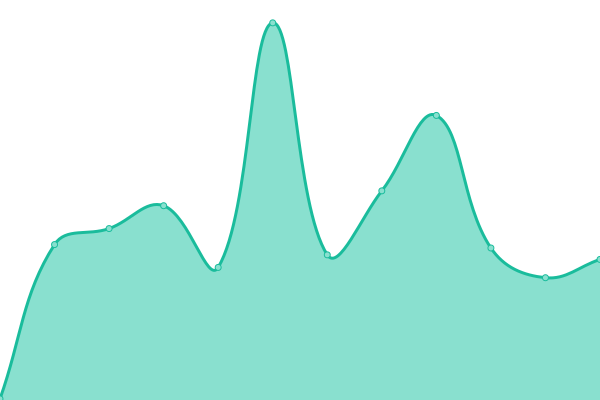

# [📈 Live Status](https://status.underthere.xyz): <!--live status--> **🟧 Partial outage**

This repository contains the open-source uptime monitor and status page for services [underthere](https://status.underthere.xyz), powered by [Upptime](https://github.com/upptime/upptime).

<!--start: status pages-->
<!-- This summary is generated by Upptime (https://github.com/upptime/upptime) -->
<!-- Do not edit this manually, your changes will be overwritten -->
<!-- prettier-ignore -->
| URL | Status | History | Response Time | Uptime |
| --- | ------ | ------- | ------------- | ------ |
|  [Jellyfin](https://jellyfin.underthere.xyz) | 🟩 Up | [jellyfin.yml](https://github.com/ChrisMoriarty/upptime/commits/HEAD/history/jellyfin.yml) | 

 273ms
     
 | 

<a href="https://status.underthere.xyz/history/jellyfin">99.76%</a>
    

|  [Jellyseerr](https://jellyseerr.underthere.xyz) | 🟩 Up | [jellyseerr.yml](https://github.com/ChrisMoriarty/upptime/commits/HEAD/history/jellyseerr.yml) | 

 1994ms
     
 | 

<a href="https://status.underthere.xyz/history/jellyseerr">99.79%</a>
    

|  [Immich](https://immich.underthere.xyz) | 🟩 Up | [immich.yml](https://github.com/ChrisMoriarty/upptime/commits/HEAD/history/immich.yml) | 

 1438ms
     
 | 

<a href="https://status.underthere.xyz/history/immich">99.78%</a>
    

|  [Mealie](https://mealie.underthere.xyz) | 🟩 Up | [mealie.yml](https://github.com/ChrisMoriarty/upptime/commits/HEAD/history/mealie.yml) | 

 446ms
     
 | 

<a href="https://status.underthere.xyz/history/mealie">99.72%</a>
    

|  [Tandoor](https://tandoor.underthere.xyz) | 🟩 Up | [tandoor.yml](https://github.com/ChrisMoriarty/upptime/commits/HEAD/history/tandoor.yml) | 

 741ms
     
 | 

<a href="https://status.underthere.xyz/history/tandoor">99.72%</a>
    

|  [Vaultwarden](https://vaultwarden.underthere.xyz) | 🟥 Down | [vaultwarden.yml](https://github.com/ChrisMoriarty/upptime/commits/HEAD/history/vaultwarden.yml) | 

 1619ms
     
 | 

<a href="https://status.underthere.xyz/history/vaultwarden">99.81%</a>
    

|  [Paperless](https://paperless.underthere.xyz) | 🟩 Up | [paperless.yml](https://github.com/ChrisMoriarty/upptime/commits/HEAD/history/paperless.yml) | 

 588ms
     
 | 

<a href="https://status.underthere.xyz/history/paperless">99.74%</a>
    

|  [Emby](https://emby.underthere.xyz) | 🟩 Up | [emby.yml](https://github.com/ChrisMoriarty/upptime/commits/HEAD/history/emby.yml) | 

 312ms
     
 | 

<a href="https://status.underthere.xyz/history/emby">99.84%</a>
    

|  [Audiobookshelf](https://audiobookshelf.underthere.xyz) | 🟩 Up | [audiobookshelf.yml](https://github.com/ChrisMoriarty/upptime/commits/HEAD/history/audiobookshelf.yml) | 

 355ms
     
 | 

<a href="https://status.underthere.xyz/history/audiobookshelf">99.77%</a>
    

|  [Peertube](https://peertube.underthere.xyz) | 🟩 Up | [peertube.yml](https://github.com/ChrisMoriarty/upptime/commits/HEAD/history/peertube.yml) | 

 252ms
     
 | 

<a href="https://status.underthere.xyz/history/peertube">99.82%</a>
    

|  [Forgejo](https://forgejo.underthere.xyz) | 🟩 Up | [forgejo.yml](https://github.com/ChrisMoriarty/upptime/commits/HEAD/history/forgejo.yml) | 

 1923ms
     
 | 

<a href="https://status.underthere.xyz/history/forgejo">100.00%</a>
    

|  [RomM](https://romm.underthere.xyz) | 🟩 Up | [rom-m.yml](https://github.com/ChrisMoriarty/upptime/commits/HEAD/history/rom-m.yml) | 

 1596ms
     
 | 

<a href="https://status.underthere.xyz/history/rom-m">99.83%</a>
    

<!--end: status pages-->

[**Visit our status website →**](https://status.underthere.xyz)

## 📄 License

- Powered by: [Upptime](https://github.com/upptime/upptime)
- Code: [MIT](./LICENSE) © [Anand Chowdhary](https://anandchowdhary.com), supported by [Pabio](https://pabio.com)
- Data in the `./history` directory: [Open Database License](https://opendatacommons.org/licenses/odbl/1-0/)
